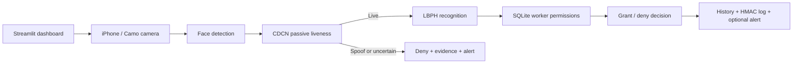

# NexusGate Biometric Access Control

A Windows-based biometric access-control prototype with passive face anti-spoofing, department authorization, evidence capture, email alerts, and tamper-evident audit logs.

## Overview

NexusGate verifies three questions for a door-access attempt:

1. Is a visible face likely to be a live presentation rather than a photo or screen replay?
2. Does that face correspond to a registered worker?
3. Is that worker authorized for the selected department?

The application runs locally through a Streamlit dashboard and uses an iPhone camera exposed to Windows through Camo. It was designed for a practical office flow: no blink, smile, or head-turn challenge is required.

## Final System Features

- Worker registration with 100-face-image enrollment and duplicate-face checking.
- Department authorization for `SOC`, `Administration`, and `Server Room`.
- Passive anti-spoofing based on a locally trained CDCN-style neural network.
- LBPH facial identification using OpenCV.
- Single decision per access window: 7 seconds after face detection, or 5 seconds for a clear spoof.
- Evidence image capture for denied, unknown, uncertain, or spoof attempts.
- SMTP email security alerts with attached capture evidence.
- SQLite access history.
- HMAC-SHA256 tattooed logs that reveal post-event modification.
- Dashboard view for live decision display and audit-log verification.

## Architecture



## Tools and Technologies Used

| Tool / technology | Use in the system | Technical role |
| --- | --- | --- |
| Python | Application implementation | Coordinates the camera, recognition, decision, audit, and dashboard workflows |
| Streamlit | Web dashboard | Provides registration, access-control, history, and integrity-verification views |
| Camo + iPhone camera | Video source | Exposes the mobile camera as a Windows webcam for live acquisition |
| OpenCV | Computer vision | Captures frames, detects faces, stores evidence images, and runs LBPH recognition |
| PyTorch | Anti-spoofing inference and training | Runs the CDCN-style passive presentation-attack detector |
| NumPy | Numerical processing | Supports frame and model-score operations |
| SQLite | Local persistence | Stores workers, department permissions, and access-history records |
| HMAC-SHA256 | Log integrity protection | Signs audit records so later alterations are detected |
| SMTP / Gmail app password | Security alert delivery | Emails spoofing, denied-access, and integrity-alert evidence |

## Anti-Spoofing Design

### Chosen approach: CDCN SpoofGate

The final passive liveness module uses a Central Difference Convolutional Network (CDCN)-style architecture. Central-difference convolutions emphasize local intensity variations and texture gradients that help distinguish real facial appearance from a flat printed or displayed presentation.

The training objective includes an auxiliary live-map prior: live samples are trained toward a non-flat facial structure map, while spoof samples are trained toward a near-zero map. With an ordinary RGB camera this is **not physical depth measurement**; it is a learned RGB cue for presentation-attack detection.

### Decision policy

- The scan timer begins only after a face is detected.
- Live decision threshold: `0.42`.
- Clear spoof threshold: median liveness score `<= 0.20`.
- Normal access transaction: one decision after 7 seconds.
- Clear spoof transaction: denial after 5 seconds.
- A camera window produces one final log and at most one email alert.

### Approaches evaluated and rejected

| Approach | Issue observed | Outcome |
| --- | --- | --- |
| DeepFace / MiniFASNet | High-quality photo could be classified as real | Rejected |
| Multi-frame DeepFace gate | A photo obtained repeated REAL decisions | Rejected |
| rPPG pulse liveness | Required 12 seconds and approximately 120-200 frames for a stable signal; photo acceptance still occurred | Rejected as impractical |
| OpenVINO anti-spoof model | Strong sensitivity to crop and color preprocessing; real face blocks occurred | Rejected |
| DeePixBiS ONNX | Certain preprocessing modes saturated for both real and photo samples | Rejected |
| Active challenge | User interaction such as blinking is unsuitable for normal office entry | Not selected |
| Dedicated IR/depth hardware | Stronger physical-depth route but requires unavailable additional hardware | Future option |

## Measured Prototype Results

The final controlled validation used the implemented threshold `0.42` with five documented real-face attempts and four documented photo/screen spoof attempts.

| Class | Recorded CDCN median scores | Errors |
| --- | --- | --- |
| Real face | `0.732`, `0.754`, `0.513`, `0.542`, `0.526` | `0 / 5` false rejects |
| Spoof presentation | `0.045`, `0.040`, `0.099`, `0.025` | `0 / 4` false accepts |

| Metric | Computation | Observed value |
| --- | --- | --- |
| FAR / APCER | accepted spoofs / spoof attempts = `0 / 4` | `0.00%` |
| FRR / BPCER | rejected real attempts / real attempts = `0 / 5` | `0.00%` |
| Accuracy | correct attempts / attempts = `9 / 9` | `100.00%` |
| Observed EER | maximum spoof score `0.099` is below minimum real score `0.513` | `0.00%` on this internal sample |
| Score separation gap | `0.513 - 0.099` | `0.414` |

These values describe internal prototype testing in one environment. They are not an independent PAD certification and should not be generalized to every attack type, user, device, or lighting condition.

## Privacy and Repository Safety

This repository intentionally excludes:

- raw face enrollment images;
- collected real/spoof training images;
- security capture images;
- SQLite operational databases;
- access logs and tattooed logs;
- HMAC secret keys;
- locally trained/downloaded model artifacts;
- SMTP credentials.

Do not commit any of those items. Biometric data is sensitive personal data, and mail app-passwords must remain local environment variables.

## Installation on Windows

### Prerequisites

- Python 3.10 or later.
- An iPhone camera exposed as a Windows webcam through Camo, or another compatible camera.

```powershell
git clone <repository-url>
cd biometric-access-control
python -m venv venv
.\venv\Scripts\activate
python -m pip install --upgrade pip
pip install -r requirements.txt
```

Set the camera index/backend if necessary in `src/config.py`:

```python
CAMERA_INDEX = 0
CAMERA_BACKEND = "MSMF"
```

Optional camera discovery tools:

```powershell
python src\list_cameras.py
python src\detect_camo_backend.py
```

## Initial Model Setup

Models and biometric datasets are deliberately not distributed in Git.

### 1. Collect local anti-spoofing samples

Collect genuine face samples:

```powershell
python src\collect_cdcn_samples.py --label real --count 400
```

Collect attack samples by presenting photos and screen images to the camera:

```powershell
python src\collect_cdcn_samples.py --label spoof --count 400
```

### 2. Train and test the passive liveness model

```powershell
python src\train_cdcn_spoofgate.py --cpu
python src\test_cdcn_spoofgate.py --cpu
```

### 3. Enroll workers

Start the dashboard, open **Register Worker**, and follow the enrollment process. The application records face samples locally and trains the LBPH identity model.

## Email Alert Configuration

Set SMTP credentials only in the current PowerShell session:

```powershell
$env:ALERT_EMAIL_SENDER="your_sender@gmail.com"
$env:ALERT_EMAIL_PASSWORD="your_google_app_password"
$env:ALERT_EMAIL_RECEIVER="security_receiver@gmail.com"
$env:SMTP_SERVER="smtp.gmail.com"
$env:SMTP_PORT="587"
python src\test_email.py
```

Never put credentials inside source files or commit them to Git.

## Run the Application

```powershell
python -m streamlit run src\dashboard.py
```

Open the local URL printed by Streamlit, then:

1. Register a worker and allocate department permissions.
2. Select **Access Control** and choose a target department.
3. Start biometric access control.
4. Review the live result and the **Tattooed Logs** page.

## Tamper-Evident Logs

Every audit line is signed using:

```text
HMAC-SHA256(secret_key, "timestamp | user | status | confidence")
```

Changing any signed value invalidates that line. Verification is available in the dashboard under **Tattooed Logs** or through:

```powershell
python src\verify_logs.py
```

The dashboard emails an integrity alert when it detects a newly modified tattooed log, without repeatedly emailing for the same unchanged tamper event.

## Project Structure

```text
biometric-access-control/
|-- src/
|   |-- dashboard.py                 # Streamlit UI
|   |-- register_worker.py           # Registration and duplicate check
|   |-- recognize_cdcn.py            # Final access transaction
|   |-- cdcn_liveness_gate.py        # Passive liveness policy
|   |-- spoofgate_cdcn_model.py      # CDCN-style architecture
|   |-- collect_cdcn_samples.py      # Local PAD dataset collection
|   |-- train_cdcn_spoofgate.py      # PAD model training
|   |-- train_model.py               # LBPH model training
|   |-- database.py                  # SQLite persistence
|   |-- watermark_logs.py            # HMAC audit integrity
|   `-- email_alerts.py              # SMTP alerts
|-- data/                            # Local-only data (ignored)
|-- captures/                        # Local-only evidence (ignored)
|-- logs/                            # Local-only logs (ignored)
|-- models/                          # Local-only models/keys (ignored)
|-- .env.example
|-- .gitignore
`-- requirements.txt
```

## Authors

- Ihab Mrabet
